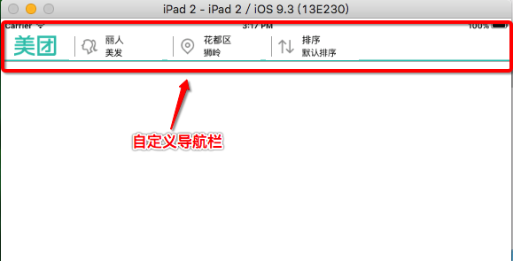
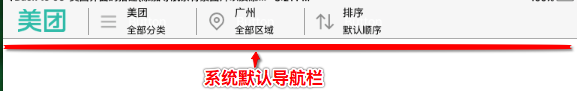
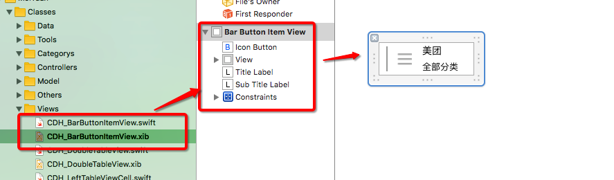
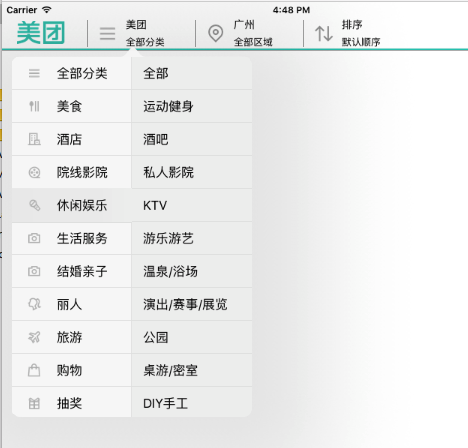
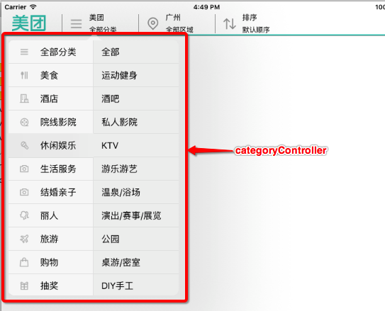
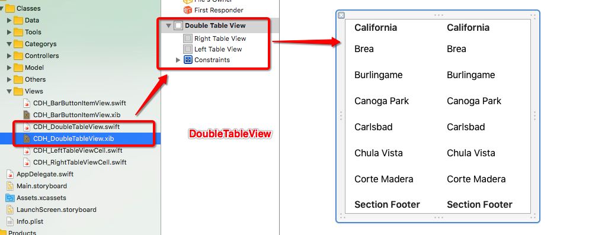
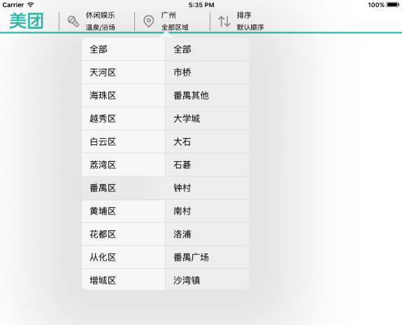
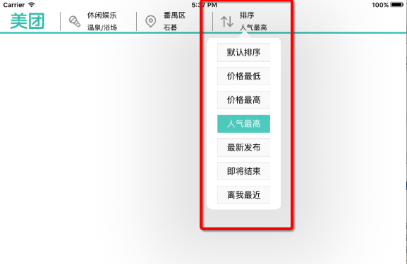
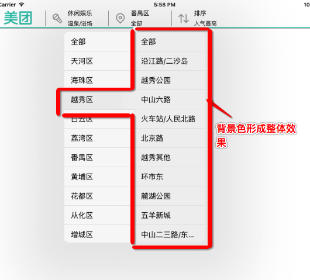

# 美团 MeiTuan - iPad

---

> 这里模仿了一下美团的 iPad 的导航栏以及下拉菜单的界面, 使用 iPad 特有的 popover 的下拉菜单的功能.

## 功能模块:
1. <a href="#导航栏">导航栏</a>
2. <a href="#主界面">主界面</a>
3. <a href="#分类界面">分类界面</a>
4. <a href="#区域界面">区域界面</a>
5. <a href="#排序界面">排序界面</a>
6. <a href="#模型">模型</a>
7. <a href="#自定义 cell">自定义 cell</a>

---

##1. <a name = "导航栏"></a>导航栏

###1.1 显示效果

* **美团导航栏背景图设置**




* **根据以上两个图可以看出:**
	* 系统默认的导航栏下边有条很细的分割线
	* 美团应用中导航栏下边的分割线是自定义的
	

* **自定义导航栏的分割线**
	* 通过自定义控制器`CDH_NavigationController`管理
	* 重写`initialize`方法, 该方法只有当前类第一被使用才会调用
	* 在`initialize`方法中设置导航的背景图片
	
		
```swift
    override class func initialize() {
        
        // 取出导航条
        let navigationbar = UINavigationBar.appearanceWhenContainedInInstancesOfClasses([self])
        
        // 设置导航条的背景图片
        navigationbar.setBackgroundImage(UIImage(named: "bg_navigationBar_normal"), forBarMetrics: .Default)
    }

```

---
##2. <a name = "主界面"></a>主界面

###2.1 自定义导航上的按钮
* **导航栏上的按钮分析**
	* 导航栏上的按钮应用系统提供的 `Bar Button Item` 或者 `Button`不能满足需求, 因此需要自定义`Bar Button 	Item View`
	
	

	* 在自定义`CDH_BarButtonItemView`中提供快速创建的类方法
	
* **注意: 一定要取消跟随父控件的宽高拉伸(取消有多种方法), 如果不取消跟随父控件拉伸, 则在横屏和竖屏转换的时候会有可能导致控件无法正常显示**
	* 方法一: `autoresizingMask = UIViewAutoresizing.None`
	* 方法二: 也可以通过工具栏设置, 先取消 `autoresizing`选项 , 在取消掉跟随父控件的拉伸宽高拉伸, 在选择中 `autoresizing`, 之所以要再次选中`autoresizing`为了不影响对子控件布局, 可以达到不跟随父控件
	* 方法三: 直接将在创建 `xib`文件时系统默认创建的 `View`, 再在往空的 `xib`文件中添加一个作为父控件 `View`来容放子控件布局, 这么一来新的`View`是默认不会跟随父控件的宽高进行拉伸


* **导航栏上的按钮 `Bar Button Item`通过懒加载创建**
	* **如:**
	* 在初始话`categoryItem`时的`UIView`是使用自定的`CDH_BarButtonItemView`创建出来的`categoryView`
	* 添加点击事件监听

```swift
	// MARK: - 懒加载自定义的items控件
    lazy var categoryItem : UIBarButtonItem = {
        // 初始化分类按钮 Item
        let categoryView = CDH_BarButtonItemView.barButtonItemView(UIImage(named: "icon_category_-1")!, highlightedImage: UIImage(named: "icon_category_highlighted_-1")!, title: "美团", subTitle: "全部分类")
        let categoryItem = UIBarButtonItem(customView: categoryView)
        
        // 监听点击事件
        categoryView.iconButton.addTarget(self, action: #selector(categoryClick), forControlEvents: .TouchUpInside)
        return categoryItem
    }()
	lazy var regionItem : UIBarButtonItem = { 
		// 略
    }()
    lazy var sortItem : UIBarButtonItem = { 
    	// 略
    }()
```
```swift
// MARK: - 布局子控件
extension CDH_HomeViewController {
    // MARK: - 据导航栏
    func setUpBarButtonItems() -> Void {
        // 1.设置logo的 item // plain 平铺模式
        let  logoItem = UIBarButtonItem(image: UIImage(named: "icon_meituan_logo"), style: .Plain, target: nil, action: nil)
        // 1.1 取消点击事件的功能
        logoItem.enabled = false
        
        // 2.添加到导航栏
        navigationItem.leftBarButtonItems = [logoItem, categoryItem, regionItem, sortItem]
    }
}
```

###2.2 按钮点击事件
* **当监听到导航栏上的`Bar Buttom Item`被点击是弹出对饮的下拉菜单**
* **注意:** 一定要设置内容控制器的弹出位置, 如果不进行设置, 则系统是不清楚从哪个位置弹出
* **注意:** 在`popover`弹出下拉菜单时要将导航栏栏上所有能够响应点击事件并且也具有 `popover`出控制器的`Bar Buttom Item`的交互使能`false`
* **注意:** 设置代理, 通过代理在 dismiss 当前下拉菜单时, 做恢复 `Bar Buttom Item` 交互使能`true`

```swift
// MARK: - 按钮点击事件
extension CDH_HomeViewController{
    @objc private func categoryClick(){
        presentVC(categoryVC, barButtonItem: categoryItem)
    }
    private func presentVC(viewController : UIViewController, barButtonItem : UIBarButtonItem){
        // 0.设置代理, 通过代理在 dismiss 当前下拉菜单时, 做恢复 Bar Buttom Item 交互使能
        viewController.popoverPresentationController?.delegate = self
        // 1.设置内容控制器的弹出位置
        viewController.popoverPresentationController?.barButtonItem = barButtonItem
        // 2.弹出内容控制器
        presentViewController(viewController, animated: true, completion: nil)
        
        // 3.将所有的按钮设置为不能点击
        barButtonItemsDisable()
    }
}
```
```swift
// MARK: - UIPopoverPresentationControllerDelegate
extension CDH_HomeViewController : UIPopoverPresentationControllerDelegate {
    // 当通过 popover 出来的 Controller 被 dismiss 时, 开启所有的 barButtonItems 交互使能
    func popoverPresentationControllerDidDismissPopover(popoverPresentationController: UIPopoverPresentationController) {
		// 在这里开始按钮交互使能
		barButtonItemsEnable()
    }
}
```

###2.3 懒加载创建下拉菜单控制器

* **注意:** 在懒加载创建被弹出的控制器在创建的时候一定要指定弹出样式为`popover`
* 通过懒加载创建, 在控制器 `View`被 `dismiss`的时候不影响控制器`view`中的数据状态, 在下次控制器`view`被显示的时候还是上次显示的状态, 说白了, 只要控制器在控制器的 `View`也就在, 并且内部的数据显示状态也就都保留, 只是控制器 `view`是否被显示的区别  

```swift
    // MARK: - 懒加载控制器
    lazy var categoryVC : CDH_CategoryViewController = {
        // 创建内容控制器
        let categoryVC = CDH_CategoryViewController()
        
        // 设置弹出样式为 popover
        categoryVC.modalPresentationStyle = .Popover
               
        return categoryVC
    }()
```

---

##3. <a name = "分类界面"></a>分类界面
###3.1 下拉菜单分类界面

* **分类控制的显示**



###3.2 下拉菜单分类界面的功能实现
1. 点击选择左边分类会关联对应的右边的分类   
2. 如果左边的某分类没有自己对应的子分类则直接消失隐藏下拉菜单
3. 如果左边的某分类有自己对应的子分类, 则在选择子分类之后再隐藏下拉菜单
4. 选择到对应的分类之后, 会将对应分类的名称和图标设置到导航栏的分类选择按钮上
5. 在下拉控制器被 dismiss 之后, 再次点击分类的选择按钮下拉菜单是有记忆能力, 也就再次弹出下拉菜单是仍然显示上一次的选择分类位置


###3.3 主要技术点

####3.3.1 分类控制器`CDH_CategoryViewController`业务逻辑

* **懒加载`plist`文件中的数据, 并通过字典转模型**
* **懒加载自定义的`CDH_DoubleTableView`类型控件, 同时给该控制键设置数据源和代理, 并遵守协议实现方法**
	* 将 `self` 设置为 `CDH_DoubleTableView `的代理和数据源, 并且实现模仿系统自定数据源和代理协议的方法
	* 在对应的数据源方法中给 `CDH_DoubleTableView` 的左右两边 `leftTableView` 和 `rightTableView`分别设置数据
* **数据回传设置导航栏 `BarButtonItem` 的图片和文字等数据**
	* 回传数据, 我使用的是自定义的闭包, 当然也可以使用通知和代理; 之前使用 OC 的时, 苹果官方文档明确提出推荐使用 `block`
	* 在 Swift 中闭包(`closure`)就相对于 OC 中的(`block`), 所以我这里也就简单的使用 `closure` 作为回调
	* 在`CDH_DoubleTableView`对应的代理方法中给自定义闭包(`closure`)设置数据, 实现数据回调到主页控制 `CDH_HomeViewController` 
	
```swift
/// 自定义定义闭包类型,并且给闭包区别名 : 分类闭包
typealias CategoryClosure = (( categoryItem : CDH_CategoryItem ,  subcategoryTitle : String?)->())
```
```swift
    // 定义一个闭包的属性
    var categoryItemColsure = CategoryClosure?()
```
```swift
// 2.取出右边点击子分类的数据给闭包数据设置数据
categoryItemColsure!(categoryItem : categoryItem, subcategoryTitle : subTitle)
```
```swift
// 这个在 CDH_HomeViewController 控制器懒加载控制器的闭包中
        // 回调设置数据
        categoryVC.categoryItemColsure = { [weak self](item ,subTitle) -> () in
            
            // 数据刷新之后隐藏控制器  
            // 这里用动画延时所以可以现在设置数据之前, 如果当如果设置数据是耗时操作, 则是最好不要这样写
            categoryVC.dismissViewControllerAnimated(true, completion: {
                // 并且开启按钮点击功能
                self!.barButtonItemsEnable()
            })
            
            guard subTitle != nil else{
                // 设置数据
                let categoryView = self!.categoryItem.customView as! CDH_BarButtonItemView
                categoryView.iconButton.setImage(UIImage(named: "icon_category_-1") , forState: .Normal)
                categoryView.iconButton.setImage(UIImage(named: "icon_category_highlighted_-1"), forState: .Highlighted)
                categoryView.titleLabel.text = "美团"
                categoryView.subTitleLabel.text = "全部分类"
                
                return
            }
            // 设置数据
            let categoryView = self!.categoryItem.customView as! CDH_BarButtonItemView
            categoryView.iconButton.setImage(UIImage(named: item.icon) , forState: .Normal)
            categoryView.iconButton.setImage(UIImage(named: item.highlighted_icon), forState: .Highlighted)
            categoryView.titleLabel.text = item.name
            categoryView.subTitleLabel.text = subTitle
        }

```


####3.3.2 自定义`CDH_DoubleTableView`

* **`CDH_DoubleTableView` 展示数据, 模仿系统 `UITableView` 给自定义 `CDH_DoubleTableView` 定制数据源协议(`CDH_DoubleTableViewDataSource`)和代理协议(`CDH_DoubleTableViewDelegate`)**
* **将整个`CDH_DoubleTableView` 的数据源和代理都交同一个控制器管理,并实现自定义的数据源方法和代理方法即可**
* **如此一来就跟我们平时使用`UITableView`是一样的了, 只要创建`CDH_DoubleTableView`, 并设置数据源和代理, 并确要求实现对应的数据源方法和代理方法即可**
* **内部的 `leftTableView` 和 `rightTableView` 的数据源和代理都是 `CDH_DoubleTableView `来负责处理业务逻辑即可, 外部无需知道内部是如何处理数据**
	* 内部只要通过条件分支语句判断, 即可区别 `leftTableView` 和 `rightTableView` 数据与业务
	
	
	
```swift
// MARK: - 制定数据源协议
@objc protocol CDH_DoubleTableViewDataSource : NSObjectProtocol {
    
    // MARK: - 左边 tableView 的数据源方法
    /// 必须实现, 返回值设置 leftTableView 每组多少行 cell
    func leftTableView(leftTableView: UITableView, numberOfRowsInSection section: Int) -> Int
    /// 必须实现, 返回值设置 tableView 对应索引的 cell
    func leftTableView(leftTableView: UITableView, cellForRowAtIndexPath indexPath: NSIndexPath) -> UITableViewCell

    // MARK: - 右边 rightTableView 的数据源方法
    /// 必须实现, 返回值设置 tableView 每组多少行 cell
    func rightTableView(rightTableView: UITableView, numberOfRowsInSection section: Int ,didSelectRowAtIndexPathOfLeftTableView indexPathOfLeftTableView: NSIndexPath) -> Int
    /// 必须实现, 返回值设置 tableView 对应索引的 cell
    func rightTableView(rightTableView: UITableView, cellForRowAtIndexPath indexPath: NSIndexPath, didSelectRowAtIndexPathOfLeftTableView indexPathOfLeftTableView: NSIndexPath) -> UITableViewCell
}
```
```swift
// MARK: - 制定代理协议
@objc protocol CDH_DoubleTableViewDelegate : NSObjectProtocol {
    
    /// 必须实现, 代理方法, 点击左边cell的时候告诉代理,左边点击了第几行
    func leftTableView(leftTableView : UITableView , didSelectRowAtIndexPath indexPath: NSIndexPath)
    
    /// 可选实现, 代理方法, 点击右边cell的时候告诉代理 右边点击了第几行,左边点击了第几行
    optional func rightTableView(rightTableView : UITableView , didSelectRowAtIndexPath indexPath : NSIndexPath, didSelectRowAtIndexPathOfLeftTableView indexPathOfLeftTableView : NSIndexPath )
}
```	
```swift
class CDH_DoubleTableView: UIView {

    // MARK: - 控件属性
    @IBOutlet weak var leftTableView: UITableView!
    @IBOutlet weak var rightTableView: UITableView!
    
    // MARK: - 代理属性
    weak var delegate : CDH_DoubleTableViewDelegate?
    // MARK: - 数据源属性
    weak var dataSource : CDH_DoubleTableViewDataSource?
}
```

---

##4. <a name = "区域界面"></a>区域界面

###4.1 界面显示



> 略: 功能实现与 分类界面 基本相同

---

##5. <a name = "排序界面"></a>排序界面

###5.1 界面显示


###5.2 功能实现
* **懒加载`plist`文件数据, 并通过字典转模型**
* **自定义闭包类型, 并给闭包区别别名, 通过闭包别名定义闭包属性, 用于数据回传**
* **根据加载的数据, 创建对应数量的按钮控制键并添加到控制器的 `View` 中**
* **按钮点击逻辑选中三部曲, 并在监听按钮点击调用的方法中给闭包数据设置参数**

```swift
// MARK: - 按钮点击事件
extension CDH_SortViewController {
    func buttonClick(sender : UIButton) -> Void {
        selectedButton?.selected = false
        selectedButton = sender
        selectedButton?.selected = true
        
        // 取出模型
        let sortItem = sortDatas[sender.tag]
        // 设置闭包参数
        SortItemColsure?(sortItem: sortItem, subSortTitle: sortItem.label)
    }
}
```

---

##6. <a name = "模型"></a>模型

###6.1 自定义模型
* **创建一个 `CDH_BaseItem` 作为模型的基类**
	* 模型基类实现自定义 init(dict : [String : NSObject]) 字典转模型的方法
	* 重写父类的 `override func setValue(value: AnyObject?, forUndefinedKey key: String) {}` 空操作避免模型中没有字典里所对应得属性导致运行时错误
	* 其他子模型 `CDH_CategoryItem` / `CDH_RegionItem` / `CDH_SortItem` 都是基础该模型基类, 子类模型只在定义属于自己的属性即可
	* 在加载数据的时候通过基类的构造方法做字典转模型
	
```swift
class CDH_BaseItem: NSObject {
    
    init(dict : [String : NSObject]){
        super.init()
        
        setValuesForKeysWithDictionary(dict)
    }
    // 重写这个方法, 避免模型中 找不到对应的属性与字典中 key 配对
    override func setValue(value: AnyObject?, forUndefinedKey key: String) {} 
}
```
```swift
// 这个在加载数据时候做字典转模型
        // 3.将字典转模型对象
        for dict in categoryArray {
            tempDatas.append(CDH_CategoryItem(dict :  dict))
        }
```

---

##7. <a name = "自定义 cell"></a>自定义 cell

###7.1 封装自定义的 cell


* **要做到左边被选中的 `cell` 能与右边关联的 `rightTableView` 的背景色统一, 形成一个整体效果**
	* 分别给左右`leftTableView``rightTableView`自定义自己的 `cell`
	* 提供快速创建 `cell` 的类方法, 并且内部做了 `ID` 标识重用机制
	* 给`cell` 设置对应的背景, 常态和选中状态的背景颜色
	* 以上的设置分别再对应的 `CDH_LeftTableViewCell` 和 `CDH_RightTableViewCell`  中的 `init` 方法中设置, `backgroundView` 和 `selectedBackgroundView` 通过 `UIImageView` 赋值
	
```swift
class CDH_RightTableViewCell: UITableViewCell {

    // MARK: - 快速创建 rightTableViewCell 的方法
    class func rightTableViewCell(tableView : UITableView) -> CDH_RightTableViewCell{
        let rightTableViewCellID = "rightTableViewCellID"
        var cell = tableView.dequeueReusableCellWithIdentifier(rightTableViewCellID) as? CDH_RightTableViewCell
        if cell == nil {
            cell = CDH_RightTableViewCell(style: .Default, reuseIdentifier: rightTableViewCellID)
            
        }
        return cell!
    }
    override init(style: UITableViewCellStyle, reuseIdentifier: String?) {
        super.init(style: style, reuseIdentifier: reuseIdentifier)
        
        // 设置背景图片
        self.backgroundView = UIImageView(image: UIImage(named: "bg_dropdown_rightpart"))
        self.selectedBackgroundView = UIImageView(image: UIImage(named: "bg_dropdown_right_selected"))
    }
    
    required init?(coder aDecoder: NSCoder) {
        fatalError("init(coder:) has not been implemented")
    }
}
```


---


